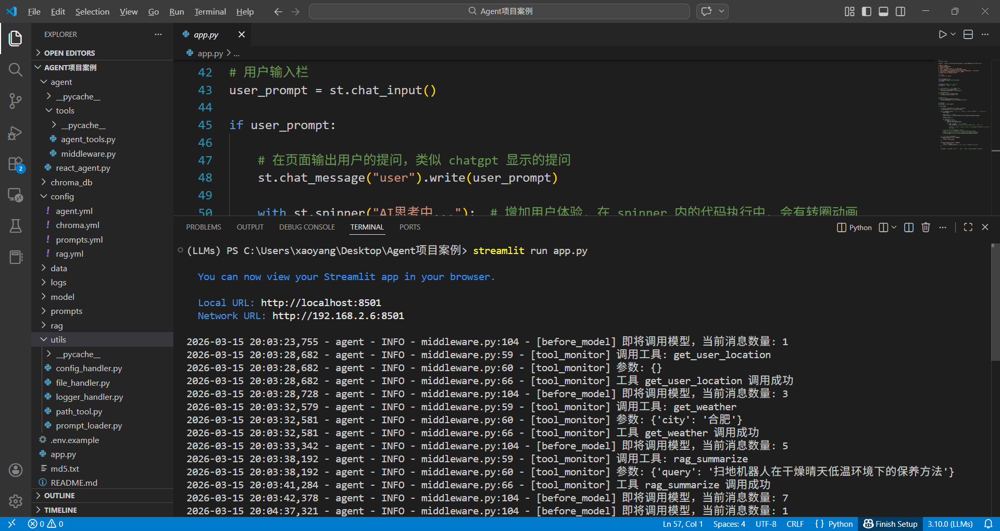
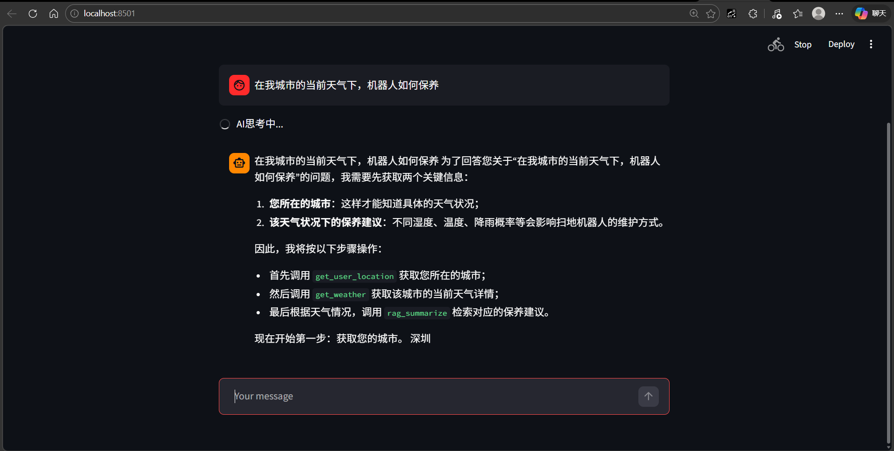
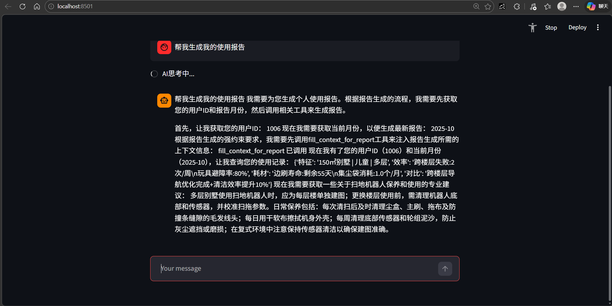
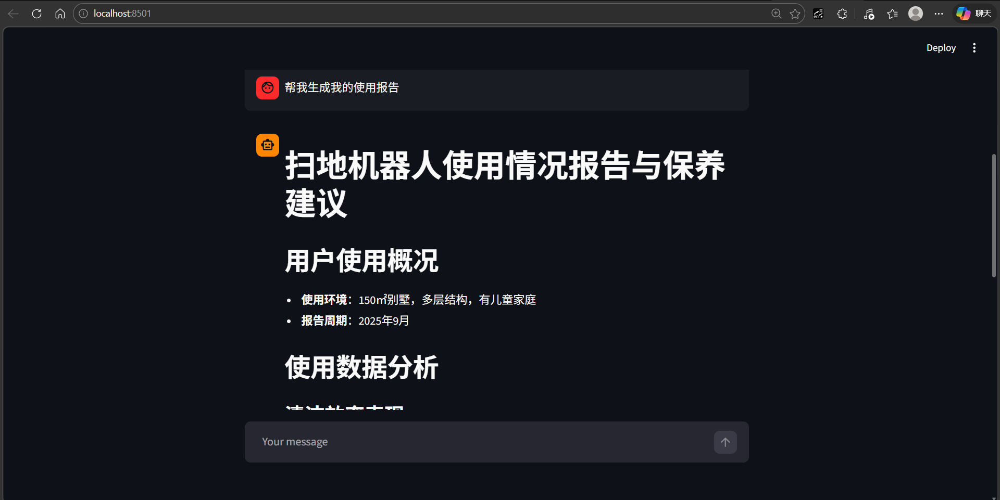

# 🤖 Agent-RAG 智能助手系统（AI Agent 实战项目）

基于 **LangChain Agent + RAG + Tool Calling** 构建的智能助手系统。  
系统能够根据用户问题 **自动推理是否调用工具、检索知识库，并结合大语言模型生成专业回答**。

本项目实现了一个完整的 **AI Agent 应用工程实践**，涵盖：

- Agent 推理框架
- RAG 知识增强
- Tool 调用机制
- Middleware 扩展
- 向量数据库
- Web 可视化交互

---

# ⭐ 项目亮点

✔ 实现 **Agent + RAG + Tool Calling 的完整工程架构**  

✔ 使用 **ReAct 推理模式** 实现 LLM 自动决策工具调用  

✔ 构建 **本地知识库问答系统（RAG）**  

✔ 实现 **Middleware 机制扩展 Agent 行为**  

✔ 支持 **Streaming 流式输出**  

✔ 使用 **Factory Pattern 管理模型实例化**  

✔ 支持 **外部数据源融合**  

✔ 提供 **Streamlit Web 可视化界面**

---


# 📷 系统运行示例


## 1️⃣ Agent 运行日志（VSCode）

<p align="center">
  
</p>

---

## 2️⃣ Agent 工具调用过程1

<p align="center">
  
</p>

---

## 3️⃣ Agent 工具调用过程2

<p align="center">
  
</p>

---

## 4️⃣ RAG 知识库检索回答

<p align="center">
  
</p>


---

# 🏗 系统整体架构

```
用户输入
   │
   ▼
Streamlit Web UI
   │
   ▼
React Agent
   │
   ▼
LLM 推理决策
   │
   ├───────────────┐
   ▼               ▼
Tool 调用        RAG 检索
   │               │
   ▼               ▼
外部数据         向量数据库
   │               │
   └───────┬───────┘
           ▼
     LLM 生成最终回答
```

---

# 🧠 Agent 工作流程

```
1. 用户输入问题

2. Agent 调用 LLM 进行推理

3. LLM 判断是否需要调用工具

4. 如果需要：
   - 调用 RAG 检索知识库
   - 或调用外部工具获取数据

5. 将检索结果或工具结果返回给 LLM

6. LLM 生成最终回答
```

---

# 📚 RAG 数据流程

```
知识文档
   │
   ▼
文本切分
   │
   ▼
Embedding 向量化
   │
   ▼
Chroma VectorDB
   │
   ▼
Retriever 检索
   │
   ▼
LLM 总结生成答案
```

---

# 🏗 项目目录结构

```
agent-rag-system
│
├── agent
│   ├── tools
│   │   ├── agent_tools.py        # Agent工具函数（天气/用户信息/外部数据/RAG等）
│   │   └── middleware.py         # Agent中间件（监控/日志/Prompt切换）
│   │
│   └── react_agent.py            # ReAct Agent封装
│
├── chroma_db                     # 向量数据库持久化目录
│
├── config                        # 项目配置文件
│   ├── agent.yml
│   ├── chroma.yml
│   ├── prompts.yml
│   └── rag.yml
│
├── data                          # 知识库与外部数据
│   ├── external
│   │   └── records.csv           # 外部数据示例
│   │
│   ├── 扫地机器人100问.pdf
│   ├── 扫地机器人100问2.txt
│   ├── 扫拖一体机器人100问.txt
│   ├── 故障排除.txt
│   ├── 维护保养.txt
│   └── 选购指南.txt
│
├── logs                          # 系统日志
│
├── model
│   └── factory.py                # 模型工厂（LLM / Embedding）
│
├── prompts                       # Prompt模板
│   ├── main_prompt.txt
│   ├── rag_summarize.txt
│   └── report_prompt.txt
│
├── rag                           # RAG模块
│   ├── rag_service.py            # RAG服务逻辑
│   └── vector_store.py           # 向量数据库管理
│
├── utils                         # 通用工具模块
│   ├── config_handler.py
│   ├── file_handler.py
│   ├── logger_handler.py
│   ├── path_tool.py
│   └── prompt_loader.py
│
├── app.py                        # Streamlit Web入口
├── md5.txt                       # 文件MD5校验（知识库更新检测）
└── test.py                       # 项目测试脚本
```

---

# ⚙️ 关键模块说明

## 1️⃣ Agent 模块

核心文件：

```
agent/react_agent.py
```

功能：

- 初始化 LangChain Agent
- 注册工具（Tools）
- 注册 Middleware
- 提供 **流式输出接口**

---

## 2️⃣ Tool 模块

```
agent/tools/agent_tools.py
```

提供 Agent 可调用工具：

| 工具 | 功能 |
|-----|-----|
| rag_summarize | 从知识库检索并总结 |
| get_weather | 获取天气信息 |
| get_user_location | 获取用户位置 |
| get_user_id | 获取用户ID |
| get_current_month | 获取当前月份 |
| fetch_external_data | 查询外部数据 |
| fill_context_for_report | 生成用户报告 |

---

## 3️⃣ Middleware 模块

```
agent/tools/middleware.py
```

实现 Agent 执行流程扩展：

| Middleware | 功能 |
|-----------|------|
| monitor_tool | 监控工具调用 |
| log_before_model | 记录模型调用日志 |
| report_prompt_switch | 动态切换报告生成 Prompt |

---

## 4️⃣ RAG 模块

```
rag/
```

功能：

- 文档加载
- 文本切分
- 向量化
- 向量数据库存储
- 向量检索

---

## 5️⃣ 模型工厂

```
model/factory.py
```

使用 **Factory Pattern** 管理模型实例化：

- LLM 模型
- Embedding 模型

方便未来 **多模型切换**。

---

# 🚀 项目启动

## 1️⃣ 安装依赖

```
pip install -r requirements.txt
```

---

## 2️⃣ 配置 API Key

在环境变量中配置：

```
DASHSCOPE_API_KEY=your_api_key
```

---

## 3️⃣ 构建向量数据库

将知识文件放入：

```
data/
```

系统会自动进行：

- 文档切分
- Embedding
- 向量存储

---

## 4️⃣ 启动 Web UI

```
streamlit run app.py
```

浏览器访问：

```
http://localhost:8501
```

---

# 🧪 模块测试

Agent 测试：

```
python -m agent.react_agent
```

工具函数测试：

```
python -m agent.tools.agent_tools
```

---

# 🛠 技术栈

- Python
- LangChain
- Streamlit
- Chroma VectorDB
- DashScope / Qwen LLM

---

# 📈 项目收获

通过本项目实践：

- 理解 **Agent 推理流程（ReAct）**
- 掌握 **RAG 系统构建**
- 熟悉 **LangChain Agent 架构**
- 实现 **LLM + 外部工具融合**
- 掌握 **AI应用工程化开发流程**

---

# 🔮 后续优化方向

- Agent Memory 记忆机制
- 多 Agent 协作系统
- Tool 并行调用
- 多向量数据库支持
- Prompt 自动优化

---

# 📜 License

MIT License